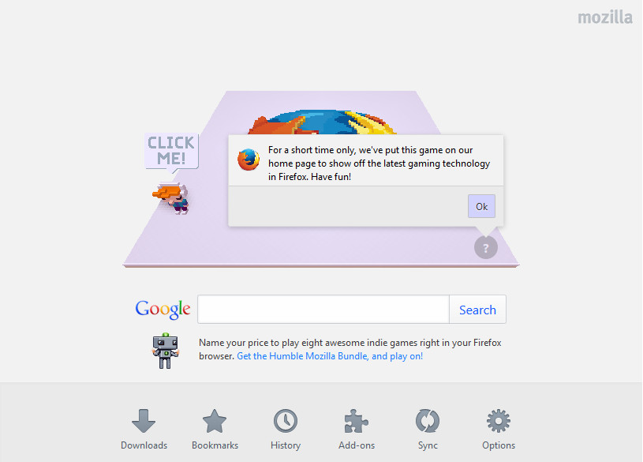

So you've heard some rumor and hear-say about asm.js, but you don't know where to start...

How about a live code example that will run in Firefox 32+. If you use the Firefox homepage when opening a new tab/window, you might have noticed the little voxel dude waiting on a game board. Clicking the "?" icon in the right-hand corner of this board produces the message, "For a short time only, we've put this game on our home page to show off the latest gaming technology in Firefox. Have fun!"



The game, message, and [link](http://mzl.la/1tr8l1i?sample_rate=0.1&snippet_name=4606) allude to the fact that these new Firefox releases include some major [updates to the SpiderMonkey engine](https://wiki.mozilla.org/Javascript:SpiderMonkey:OdinMonkey). This includes the ability to run Ahead-of-Time (asm.js) code. 

But where do you get such code? Well, short of compiling it from another language, you can actually write native JavaScript functions that will validate as asm.js within Firefox. Here's an example from the homepage of the [current working draft](http://asmjs.org/spec/latest/#introduction):

```
```


